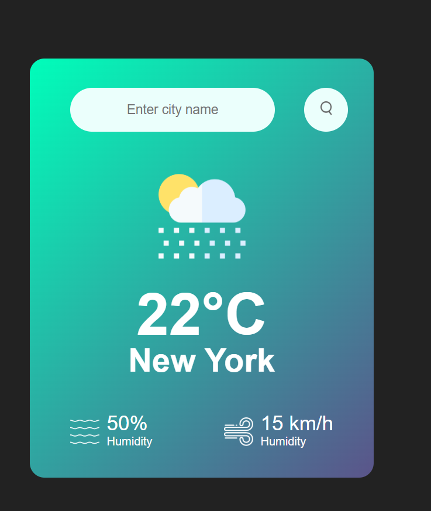

# 🌦️ Weather App

A simple weather app built with **HTML, CSS, and JavaScript** that fetches real-time weather data using the [OpenWeatherMap API](https://openweathermap.org/).

## 🚀 Features
- Search weather by city name
- Shows:
  - 🌡️ Temperature (°C)
  - 💧 Humidity (%)
  - 💨 Wind speed (km/h)
  - 🌤️ Weather description
  - ☁️ Weather icon (custom images or API icons)
- Responsive design
- Error handling for invalid city names

## 🌍 Live Demo
👉 [**Click here to view the app**](https://your-username.github.io/weather-app/)

## 📷 Screenshot

  

